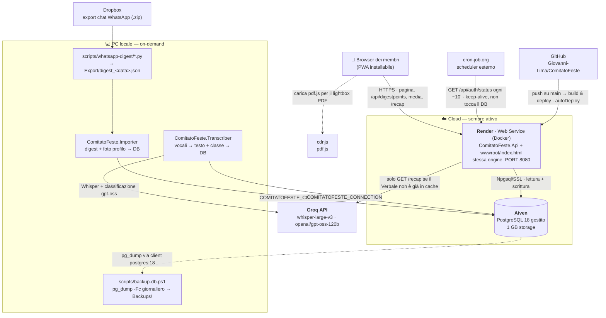

# Architettura — servizi esterni e interazioni

Mappa dei servizi di terze parti su cui gira il progetto e di come si parlano.
Il **come** si configura sta in `docs/DEPLOY.md`; il **perché** delle scelte in
`docs/CONTEXT.md`. Qui c'è solo la fotografia dei servizi.

Tutti i servizi usati sono su **piano gratuito**.

## Schema

## I servizi

| Servizio | Ruolo | Config / credenziali | Se non risponde |
|---|---|---|---|
| **Render** | Host del container: `ComitatoFeste.Api` (ASP.NET Core) che serve **anche** il frontend statico dalla stessa origine. Region Frankfurt, health check `/api/auth/status`. | Env var nella tab *Environment* (`render.yaml`, `sync:false`): `COMITATOFESTE_CONNECTION`, `COMITATOFESTE_AUTH_PASSWORD`, `COMITATOFESTE_AUTH_SECRET`, `GROQ_API_KEY` (opz.), `PORT=8080`. | Portale offline. I dati restano su Aiven, nessuna perdita. |
| **Aiven** | Unico datastore: PostgreSQL 18 gestito. Contiene tutto — `Groups`, `Members`, `IngestionRuns`, `DigestPoints`, `MediaAssets`, `MediaBlobs` (i byte dei file), `MemberProfilePhotos`, `Verbali` (cache dei verbali). | URI Aiven → stringa Npgsql in `COMITATOFESTE_CONNECTION` (usata da API, Importer, Transcriber). Copia locale in `scripts/aiven.uri` (gitignorata) per i backup. | L'API non parte (`Database.Migrate()` in `Program.cs` fallisce, voluto). Ultimo dump in `Backups/`. |
| **Groq** | LLM + speech. **Due usi distinti**: (1) *locale* — il `Transcriber` trascrive i vocali con `whisper-large-v3` e li classifica con `openai/gpt-oss-120b`; (2) *online* — Render chiama Groq **solo** su `GET /api/digestpoints/recap` quando il verbale del giorno non è ancora nella tabella `Verbali`. | `GROQ_API_KEY` (env) oppure file `key.txt` risalendo fino alla radice (`GroqKey.Resolve()`). Free tier: 1.000 req/g, 200k token/g, contatore separato per modello. | Transcriber si ferma (ritenta al run dopo). Online: `/recap` di un giorno non in cache → **503**; tutto il resto del portale funziona. |
| **cron-job.org** | Tiene "caldo" il container Render (piano free: spento dopo ~15 min di inattività, poi ~40-60 s di cold start). Un `GET https://comitatofeste.onrender.com/api/auth/status` ogni ~10 min — quell'endpoint **non** tocca il DB, quindi zero carico su Aiven. Rientra nelle 750 h/mese del free. | Un solo job schedulato con l'URL dello status. Alternativa a costo zero già nel repo: `.github/workflows/keep-alive.yaml` (GitHub Actions). | Nessun danno: il primo accesso dopo un periodo di inattività paga il cold start. |

## Flusso dei dati

**Ingestion (locale, manuale):** lo zip dell'export WhatsApp arriva in **Dropbox**
→ gli script in `scripts/whatsapp-digest/` producono `Export/digest_<data>.json` +
i media → **`Importer`** li scrive su **Aiven** → **`Transcriber`** manda i vocali a
**Groq** (Whisper + classificazione) e riscrive i punti su Aiven. Nessuno di questi
passi gira sul cloud.

**Lettura (online):** il **browser** carica il portale da **Render** (che serve
pagina + API + byte dei media dalla stessa origine) → Render legge/scrive su
**Aiven** → per un verbale non ancora in cache Render chiama **Groq**, poi lo
salva in `Verbali` (le richieste successive non ricontattano Groq). Il PDF del
verbale e i PDF condivisi nella chat vengono renderizzati nel browser con
**pdf.js** (da cdnjs).

**Deploy:** `git push` su `main` → **GitHub** notifica **Render** → build
dell'immagine Docker + redeploy (`autoDeploy: true`). Al primo boot su DB vuoto
l'API crea lo schema da sola.

**Backup:** `scripts/backup-db.ps1` (schedulato) fa `pg_dump -Fc` di **Aiven** con
un client `postgres:18` usa-e-getta → `Backups/cf-YYYY-MM-DD.dump` (rotazione 30
giorni). Il piano free di Aiven non ha PITR affidabile; in più il Postgres locale
della pipeline è già un quasi-mirror (l'unico dato solo-cloud sono i `Verbali`
generati online).

## Confini di fiducia / note

- **Endpoint binari aperti**: `/api/digestpoints/media/{id}/content` e
  `/api/members/{id}/photo` non hanno `[TokenAuth]` (servono a ``/`<audio>`
  senza header). Su dominio pubblico sono enumerabili. Follow-up previsto: token
  in querystring.
- **Login "casereccio"**: passphrase condivisa (`COMITATOFESTE_AUTH_PASSWORD`) +
  token HMAC firmato con `COMITATOFESTE_AUTH_SECRET` (30 gg). Se il secret cambia
  a ogni redeploy, tutti i login decadono → va impostato fisso.
- **CORS**: in produzione frontend e API sono sulla stessa origine, niente CORS.
  In locale l'API abilita `localhost:5173/3000`.
- **Storage Aiven 1 GB**: oggi ~50 MB. Quando i blob (PDF/video) stringono,
  `MediaBlobs` è già una tabella 1:1 separata → spostabile su object storage
  gratuito (es. Cloudflare R2) con modifica contenuta.
